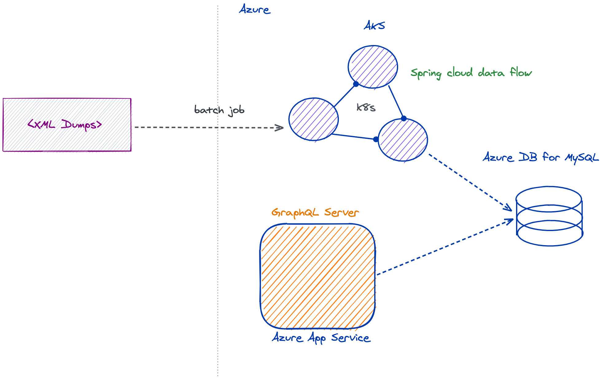

# Welcome to stack-exchange-graphql-server


[](https://travis-ci.com/snimmagadda1/stack-exchange-graphql-server)
[](https://goreportcard.com/report/github.com/snimmagadda1/stack-exchange-graphql-server)
[](LICENSE.md)

> A GraphQL implementation to expose stack overflow resources efficiently (Comments, Posts, Answers, Votes, etc)

### 🏠 [Try out the live API](https://stack-exchange-graphql-server.azurewebsites.net/)

[Stack Exchange](https://api.stackexchange.com/docs?tab=category#docs) doesn't have a GraphQL endpoint so I made one. The live API above is in POC mode for now as the schema is built. It is currently serving content from [https://anime.stackexchange.com/](https://anime.stackexchange.com/) and is updated weekly with more to come as the [pipeline & infra](https://github.com/snimmagadda1/stackexchange-dump-to-mysql) are beefed up & built out. Expect a minimal amount of latency because this is currently hosted in an App Service, which will spin down during periods of low-usage. If this happens, please be patient and the playground/requests should come blazing in after the first 'wakeup'. If this gets some traction, availability will be increased.

#### [🚀 CURRENT SCHEMA HERE 🚀](./schema/schema.graphqls)

## Usage

To run locally:

```
docker-compose up
```

and visit [http://localhost:8080](http://localhost:8080) to start using the playground or hit the endpoint with some queries! For example, to get information on a the highest scoring Q&A pages in a sub-community:

```
query postsPagination {
  allPostsCursor(first: 10, where: { order: { field: votes, order: DESC } }) {
   pageInfo {
      hasNextPage
      hasPreviousPage
    }
    edges {
      cursor
      node {
        score
        title
        body
        comments {
          userId
          text
        }
        answers {
          score
          body
          comments {
            userDisplayName
            text
          }
        }
      }
    }
  }
}

```

The server is also available as a docker container provided a separate backend exists:

```
docker run -e SERVER='<dbhost>' -e UNAME='<dbUname>' -e PASS='<dbPass>' snimmagadda/stack-exchange-graphql-server:latest
```

or to run from source:

```sh
go run cmd/server.go
```

Some environment variables must be set to run locally

| Key      | Type   | Description          | Example        |
| -------- | ------ | -------------------- | -------------- |
| `SERVER` | String | DB host              | localhost      |
| `SCHEMA` | String | app DB schema        | stacke         |
| `UNAME`  | String | app DB username cred | appuser        |
| `PASS`   | String | app DB password cred | supersecret123 |

`SERVER` should be the hostname of a MySQL DB. In order to serve content, the GraphQL server expects a populated `stacke` [schema](https://github.com/snimmagadda1/stack-exchange-dump-to-mysql/blob/master/src/main/resources/schema-base.sql).

TODO: configurable params...

## Compile

```sh
go build cmd/server.go
```

## Development

Options for development are readily flexible with more streamlined routes to come... For now the following is available:

1. Run the backend only with docker (or tweak & use `docker-compose.yml`)
    ```
    docker run --name test-mysql -e MYSQL_ROOT_PASSWORD=password -e MYSQL_ROOT_USER=root -e MYSQL_PASSWORD=password -d -p 3306:3306 mysql:5.7.26
    ```
2. [~1K rows exist here](/dev/seed.sql) will be used as inserts to your schema.

3. Create (or copy) a .env file with the variables in the table above set to configure the local GraphQL server.
4. Start the server:

```
go run cmd/server.go
```

## Run tests

```sh
TODO
```

## Built with

-   Go
-   [gqlgen](https://github.com/99designs/gqlgen)
-   [gorm](https://github.com/go-gorm/gorm)
-   [gqlparser](https://github.com/vektah/gqlparser)
-   [Azure](https://azure.microsoft.com/en-us/)
-   [Excalidraw](https://github.com/excalidraw/excalidraw)

### Current data pipeline

I'm probably going to do some refinement and swap to something like an Elastic backend but for now here's the early setup. XML dumps published by Stack Exchange are imported into an indexed relational backend using a job written with [Spring Batch](https://github.com/spring-projects/spring-batch) on a schedule. The graphql server reads from this backend to expose Stack Exchange data.


## Author

👤 **Sai Nimmagadda**

-   Website: [s11a.com](https://s11a.com)
-   Github: [@snimmagadda1](https://github.com/snimmagadda1)

## 🤝 Contributing

This project is currently in build-mode. Contributions, issues and feature requests are welcome!

Feel free to check [issues page](https://github.com/snimmagadda1/stack-exchange-graphql/issues).

## Show your support

Give a ⭐️ if this project helped you!

## 📝 License

Copyright © 2020 [Sai Nimmagadda](https://github.com/snimmagadda1).

This project is [MIT](LICENSE.md) licensed.

---

_This README was generated with ❤️ by [readme-md-generator](https://github.com/kefranabg/readme-md-generator)_
